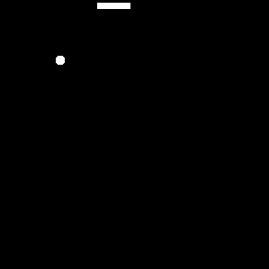

# Snake Game README
This is a simple implementation of the classic Snake game using Python and the Turtle module. In this game, the player controls a snake and the goal is to eat as much food as possible without colliding with the walls or the snake's own tail. The game ends when the snake collides with a wall or its own tail.

# Getting Started
## Prerequisites
To run this game, you need to have Python 3 installed on your machine.

# Installation
1. Clone this repository to your local machine.
2. Open the terminal and navigate to the project directory.
3. Run the following command to install the required modules:
`pip install -r requirements.txt`
4. Run the following command to start the game:
`python main.py`

# Game Instructions
- Use the arrow keys to move the snake.
- Eat the food to increase your score and the snake's length.
- Avoid hitting the walls or the snake's own tail.
- The game ends when the snake collides with a wall or its own tail.
- Press any key to play again after the game ends.

# Customization
You can customize the game by changing the following constants in main.py:

- SCREEN_WIDTH: the width of the game screen (default is 600)
- SCREEN_HEIGHT: the height of the game screen (default is 600)
- SCREEN_BACKGROUND_COLOR: the background color of the game screen (default is "black")
- GAME_SPEED: the speed of the game (default is 0.1)

# License
This program is released under the [MIT LICENSE](https://opensource.org/license/mit/), which allows you to use, modify and distribute the code freely, as long as you include the original license notice and disclaimer.

